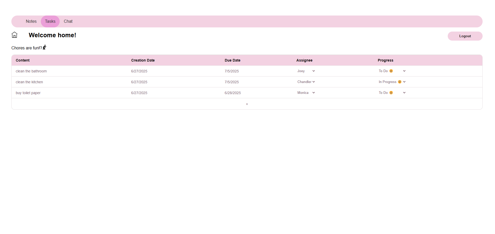
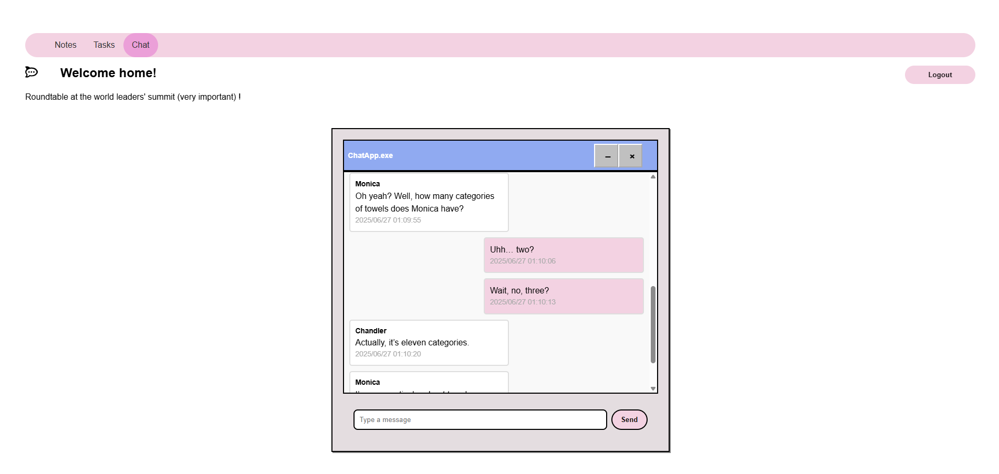

This GitHub serves as a beginner-friendly app idea for me to learn Django.

# 🏡 Coliving – A web app built for harmonious shared living (hopefully)

🚀 **Live Demo**: [View the app on Render](https://ihatemyflatmates.onrender.com)  

---

## ✨ Features

### 1. Anonymous Notes
- Leave anonymous messages for your flatmates.
- Ideal for expressing concerns (e.g. flatmate blasting techno at 2am) without triggering personal conflicts.

### 2. Chore Management
- Create and assign household tasks with deadlines, assignees, and status updates.

### 3. Group Chat
- Real-time group chat for all flatmates using **Django websockets**

---

## 🧠 Tech Stack

| Purpose       | Tech                           |
|----------------|--------------------------------|
| Frontend      | React                          |
| Backend       | Django + Django REST Framework |
| Realtime Chat | Django Channels + WebSockets   |
| Auth          | JWT (JSON Web Tokens)          |
| Database      | PostgreSQL                     |
| Deployment    | Render                         |

---

## ⚙️ Setup

### Backend
```bash
cd backend
python -m venv venv
source venv/bin/activate
pip install -r requirements.txt
python manage.py migrate
python manage.py runserver
```

### Frontend
```bash
cd frontend
npm install
npm run start
```
This project is still a work in progress — there are features to refine and areas to improve. Feedback is welcome as I continue learning and building!
⚠️ Coliving is deployed for free on Render, which may cause some short delays on first load.






